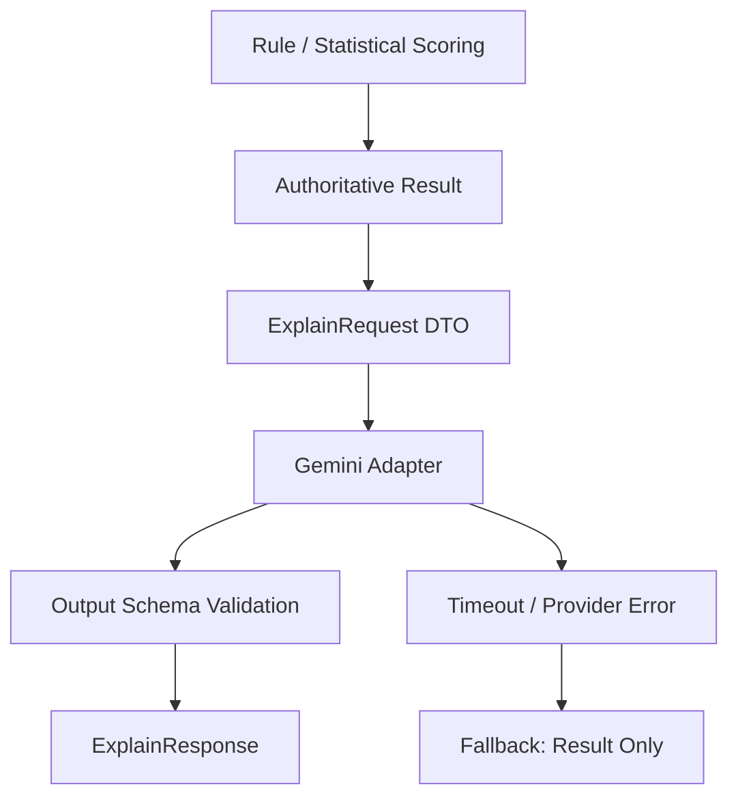

# AI — GenAI Explanation Specification

<aside>

**프로젝트:** IF · **분류:** AI/GenAI · **역할:** Gemini 기반 설명 보조 · **원칙:** AI 설명은 authoritative score·grade·matching 결과를 변경하지 않는다.

확인되지 않은 모델 성능·자동 의사결정·내부 운영 수치를 사실로 쓰지 않는다.

</aside>

## 1. AI Use Case Definition

IF에서 GenAI의 목적은 위험 점수나 직무 매칭 결과를 새로 계산하는 것이 아니라, **이미 계산된 결과와 근거를 사용자가 이해할 수 있는 설명으로 변환하는 것**이다.

### 1.1 Intended Use

- score/grade 결과 설명
- 위험 요인·근거 요약
- 사용자에게 이해 가능한 자연어 안내
- 운영자 검토용 설명 보조

### 1.2 Out-of-scope

- LLM이 score·grade를 재계산하거나 수정
- LLM 단독 자동 허용/불허 결정
- 근거 없는 직무 추천 확정
- 확인되지 않은 외부 사실 생성

---

## 2. AI Requirements

| ID | 요구 | Evidence |
| --- | --- | --- |
| AI-FR-01 | 입력은 authoritative score/result snapshot + 근거만 | IMPLEMENTED (`ExplainRequest`) |
| AI-FR-02 | 응답은 자연어 설명 필드만 | IMPLEMENTED (`ExplainResponse`) |
| AI-FR-03 | score·grade 변경 요청/출력 차단 | IMPLEMENTED (`guardrails.reject_score_mutation_fields`) |
| AI-FR-04 | 근거 부족·실패 시 추측 대신 fallback 명시 | IMPLEMENTED |
| AI-FR-05 | provider 장애 시 score 조회 계속 | IMPLEMENTED (BE explain soft-fail + AI fallback) |
| Groundedness | evidence 범위 밖 단정 금지 | DESIGNED (prompt + forbidden terms) |
| Latency | 설명 경로 timeout 격리 | DESIGNED (`GEMINI_TIMEOUT_SECONDS`) |
| Security | secret 환경변수 | IMPLEMENTED (`.env.example`) |
| Observability | prompt/model version, latency, fallback 로그 | IMPLEMENTED |
| Cost | token 측정 | PLANNED |

---

## 3. Data & Grounding

허용 grounding:

- score / grade(band) / top_factors
- 비식별 `case_summary`
- 승인된 disclaimer 문구

추적 필드(권장): `result_id`, `result_version`, `prompt_version`, `model_version`, `requested_at`

민감정보는 `mask_pii` 적용. 운영 로그에는 metadata 우선.

---

## 4. AI System Design

| 규칙 | Evidence |
| --- | --- |
| scoring ↔ explanation 분리 | IMPLEMENTED (`scoring_service` / `llm_gemini_service`) |
| LLM에 DB write 없음 | IMPLEMENTED |
| schema 외 필드 폐기 | IMPLEMENTED |
| explain 실패가 score TX rollback 안 함 | IMPLEMENTED (BE) |

코드:

- [`ai/src/app/services/scoring_service.py`](ai/src/app/services/scoring_service.py)
- [`ai/src/app/services/llm_gemini_service.py`](ai/src/app/services/llm_gemini_service.py)
- [`ai/src/app/services/guardrails.py`](ai/src/app/services/guardrails.py)

---

## 5. Prompt & Context

- System instruction: score 불변, 근거 기반, 과장·최종결정 금지
- Structured context: `risk_score`, `risk_band`, `top_factors`, masked summary
- Output schema (as-built, BE 계약): `summary` / `factor_explanations` / `guidance` / `disclaimer`
  - 스펙의 reason ≈ `guidance`, limitation ≈ `disclaimer`, next_action ≈ guidance 내 안내
- Prompt version: **`prompt_v1`** (`PROMPT_VERSION`)

RAG / autonomous agent: **필수 아님** — 현재 미도입.

---

## 6. Evaluation & Critical Invariant

**Critical invariant (release gate):** AI 호출 전후 score, grade/band, matching score가 동일해야 한다.

| Metric | Evidence |
| --- | --- |
| Correctness / Groundedness | DESIGNED (eval set PLANNED) |
| Safety (금지어·결정 암시) | IMPLEMENTED (unit) |
| Score 불변성 | IMPLEMENTED (`tests/test_ai_invariants.py`) |
| Fallback on provider miss | IMPLEMENTED |
| Full Gemini live eval | NOT TESTED (API 키·비용 의존) |

---

## 7. Responsible AI

- Intended use: 설명 보조만
- Prohibited: 자동 허용/불허, 진단·처방, score 변조
- Oversight: 담당자 FINALIZED + disclaimer
- Fabricated explanation: schema/forbidden/fallback으로 완화
- AI 출력은 자동 최종 판단자로 표현하지 않음

---

## 8. ML/DL 문서와의 관계

- **ML/DL:** score baseline·데이터·모델 후보
- **AI (본 문서):** Gemini 설명, prompt, groundedness, GenAIOps
- 연결키: input / result / version / evaluation evidence

---

## 9. Evidence 기준

`IMPLEMENTED` 조건: adapter code + prompt/schema + score 불변성 테스트 + fallback + secret 관리 근거.

그 외: DESIGNED / PLANNED / NOT TESTED.

## 기준 문서

- PRD_v0 / SRS_v0 / BE.md
- Microsoft AI Workload Docs, NIST AI RMF / GenAI Profile
