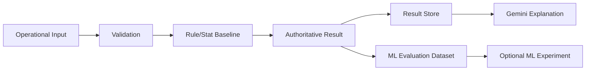

# ML — Machine Learning / DL Specification

<aside>

**IF ML/DL Specification** · Section: ML · Status: **BASELINE DEFINED** / **ML PROPOSED** / **DL NOT APPLICABLE**

규칙·통계 scoring과 ML 실험, Gemini 설명 영역을 분리해 관리한다.

MVP authoritative score는 규칙+통계만 사용한다. ML은 v2.0 후보이며, 충분한 label·baseline 대비 개선·승인 gate가 있을 때만 도입한다. DL은 현재 해당 없음.

</aside>

## 1. Document Overview

| 항목 | 내용 |
| --- | --- |
| 목적 | 위험 score·grade의 ML 확장 요구사항과 운영 경계 정의 (직무 matching MVP Out of Scope) |
| 상위 기준 | PRD v0.2 / SRS v0.1 / SDD v0.1 |
| 연결 | [`AI.md`](AI.md) (Gemini 설명), [`BE.md`](BE.md) (score API), QA Spec |
| Evidence 규칙 | 코드·dataset·evaluation 증거 없으면 `IMPLEMENTED` 금지 |

| 영역 | Status |
| --- | --- |
| Rule/Stat baseline scoring | **BASELINE DEFINED** (`rule_stat_v1`) |
| Optional ML experiment | **PROPOSED** (v2.0) |
| Deep Learning | **NOT APPLICABLE** |
| Job matching ML | Out of Scope (MVP) |

---

## 2. ML Problem Definition

- **Business problem:** scoring 결과의 정확성·추적성·설명 가능성 확보
- **Baseline:** 규칙 + 통계 (`job_risk_by_region` mart + rule adjustment)
- **ML task 후보:** classification / score prediction / ranking (미채택)
- **GenAI boundary:** Gemini는 authoritative score를 **설명만** 하며 변경하지 않음 → [`AI.md`](AI.md)
- **DL:** 현재 필요성 없음

---

## 3. ML Requirements

| 요구 | Evidence |
| --- | --- |
| input snapshot과 기준시점 식별 | DESIGNED (Explain/Score request snapshot) |
| score/grade + rule/model version 저장 | IMPLEMENTED (`scoring_version` / BE `modelVersion`) |
| explanation 전후 authoritative result 불변 | IMPLEMENTED ([`AI.md`](AI.md) invariant tests) |
| 실패 시 임의 보정 금지, fallback 명시 | IMPLEMENTED (explain fallback; score는 독립) |
| traceability / reproducibility / privacy | DESIGNED |

---

## 4. Data Specification

| 항목 | Status |
| --- | --- |
| Feature snapshot (age_band, region, job, intensity, flags) | IMPLEMENTED (ScoreRequest) |
| Score/grade + execution log | PARTIAL (score persist in BE; ML feature store N/A) |
| Approved ground truth / proxy label | **PROPOSED** (ML 도입 전제) |
| NULL/range/duplicate/time validation | DESIGNED |
| Leakage 금지 · label 규칙 version | **PROPOSED** |

---

## 5. Baseline & Model Design

**Authoritative baseline:** `rule_stat_v1`

- 통계: `data/marts/job_risk_by_region.parquet` region risk
- 규칙: work intensity / flags / elder floor rules in [`scoring_service.py`](ai/src/app/services/scoring_service.py)
- 버전 상수: [`scoring_baseline.py`](ai/src/app/services/scoring_baseline.py)

**ML 후보 (미도입):** linear/logistic, tree-based. 충분한 label + baseline 대비 재현 가능 개선 + 승인 gate 후에만 serving 교체.

실험 작업 공간(코드 없음): [`ai/ml/README.md`](ai/ml/README.md)

---

## 6. Training & Experiment Design

| 항목 | Status |
| --- | --- |
| Time-based split | PROPOSED |
| feature/hp/model/dataset version | PROPOSED |
| 실패 실험 보존 | PROPOSED |

---

## 7. Evaluation Specification

| Metric family | Status |
| --- | --- |
| Precision/Recall/F1/ROC-AUC | PROPOSED (ML 도입 시) |
| Recall@K / NDCG@K | PROPOSED (ranking 시) |
| Threshold / calibration / segment error | PROPOSED |
| Baseline 대비 acceptance gate | PROPOSED |
| Band 구간 회귀 (baseline) | IMPLEMENTED (`tests/test_ml_baseline.py`) |

---

## 8. ML/DL System Design

DL 경로 없음. H는 serving에 연결하지 않은 실험 전용(현재 미구현).

---

## 9. Serving & Integration

| 규칙 | Evidence |
| --- | --- |
| `/score` ↔ `/explain` 논리 분리 | IMPLEMENTED |
| score snapshot → explanation input | IMPLEMENTED |
| LLM timeout이 scoring에 전파되지 않음 | IMPLEMENTED (BE + AI) |
| scoring version ≠ prompt/model version | IMPLEMENTED (`rule_stat_v1` vs `prompt_v1`) |

---

## 10. QA & Validation

| Test | Status |
| --- | --- |
| Baseline band / version unit | IMPLEMENTED |
| Score↔explain invariant | IMPLEMENTED (AI tests) |
| Label leakage / fixed eval set | PROPOSED / NOT TESTED |
| ML model CI | N/A until adopted |

---

## 11–12. MLOps / Monitoring / Retraining

Registry, 승인 gate, 자동 CT, drift 기반 재학습: 모두 **PROPOSED**. MVP는 rule/stat baseline + explanation fallback rate 관찰(BE/AI 로그).

---

## 13. Responsible AI / Risk

- score를 확정적 진실·자동 허용/불허로 표현하지 않음
- human oversight: Assessment `FINALIZED` (담당자)
- 민감 feature 최소화·목적 제한 (AI guardrails PII mask)

---

## 14. Evidence 기준

`IMPLEMENTED`에 필요: scoring rule code, dataset/schema/version, baseline/eval 결과, API/integration, invariant, deploy/monitoring.

현재: **baseline rule/stat + version + band 회귀 + AI invariant**까지 IMPLEMENTED. ML training/serving은 PROPOSED.

## 15. Official References

Google ML Development Phases / Experiments / Stakeholders / Cloud MLOps CI·CD·CT · NIST AI RMF

## 기준 문서

- [`AI.md`](AI.md) · [`BE.md`](BE.md) · [`DA.md`](DA.md)
